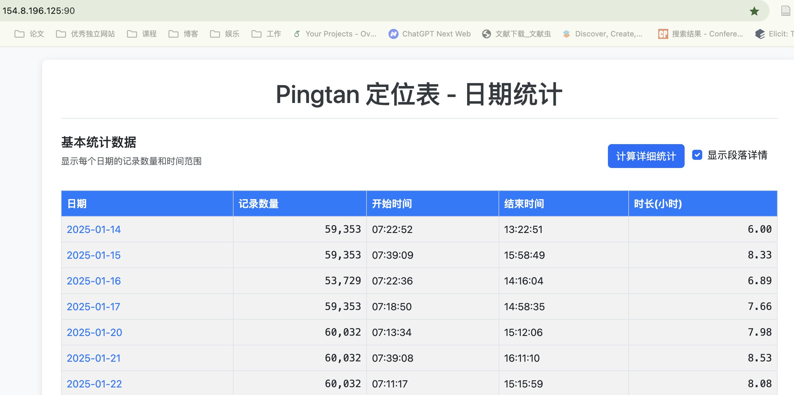

# 车辆轨迹数据分析与增强平台

这是一个基于 Flask 和 MySQL 的 Web 应用，旨在提供一个可视化、可分析、可操作的车辆行驶数据平台。用户不仅可以查看每日数据的统计摘要和详细的地图轨迹回放，还可以通过强大的后端 API 对数据进行删除、复制、自动填充和覆盖等增强操作。

## 注意⚠️：
pingtan 的数据没有实现流导入，目前是依赖微信传过来每天的数据文件，然后解压在 cwd 文件夹里面，然后使用大模型语句导入到已经 create 好的 mysql 表中。
由于 mysql 数据库性能问题和表可能没有建立比较好的索引，在资源局限的机器上运行会非常慢。推荐配置 100G 内存以上。目前导入和数据扩增都很花费时间，尤其是路径规划表，任何改动就会花费很久。
如果不能满足，可以尝试使用 spark 等大数据工具重构这个框架，理论上可以加速。
create_statements文件夹中是 mysql 数据库的创建语句，你可以进行酌情修改以提高速度。

## ✨ 主要功能

### 数据分析与可视化

  - **📅 每日数据概览**: 在主页以表格形式清晰展示每日数据的核心指标，包括记录数、起止时间、总时长等。
    
  - **📈 按需详细统计**: 通过异步请求（AJAX）计算并展示更详细的统计数据，如**真实驾驶时长**（自动排除中间的长时间静止或数据中断）和**数据段落分析**，优化了页面加载性能。
  - **🗺️ 交互式轨迹回放**:
      - 在 Leaflet 地图上精确绘制车辆的行驶轨迹。
      - 支持街道图和**卫星图**两种地图模式切换。
      - 轨迹路线根据**时间先后进行颜色渐变**（蓝 -\> 绿 -\> 黄 -\> 红），直观展示行驶过程。
        \
        
  - **▶️ 动态播放控制**:
      - 提供播放、暂停功能，并可通过**键盘空格键**快捷控制。
      - 支持**慢、中、快**三档播放速度调节。
      - 时间轴滑块（Slider）可任意拖动，实时查看任意时间点车辆的位置和状态。
      - 在地图右上角实时显示当前点的**经纬度**坐标。

### 数据管理与增强

  - **✂️ 数据段落操作**:
      - **智能分段**: 后端能自动根据时间间隔阈值（默认为5分钟）将连续数据划分为不同段落。
      - **段落复制**: 在前端UI上，可以方便地选择任一数据段落，并将其复制到当天或未来的任意新时间点，用于数据补全。
      - **段落删除**: 可一键删除指定时间段内的全部相关数据（涉及多个数据表），操作具备事务性。
  - **🤖 全自动数据增强 (`/api/auto_augment_data`)**:
      - **模拟工作日数据**: 可自动将某一天（源数据）的有效行驶片段，智能地、带随机性地填充到另一天（目标日期）的预设工作时间段（如早、中、晚）中。
      - **高度随机化**: 自动为填充的数据段之间加入随机间隔，并对数据段本身进行随机裁剪，使生成的数据更加真实。
      - **多种执行模式**: 提供标准模式、快速模式（带抽样）和超高性能SQL批量模式，以应对不同数据量和性能要求。
  - **덮어쓰기 数据覆盖 (`/api/overwrite_date`)**:
      - **完整日期替换**: 可使用指定源日期的数据，完全覆盖目标日期，并可设定期望的总数据时长（例如，生成一个6小时有效数据的天）。
      - **原子性操作**: 该功能会先**完整删除**目标日期的所有旧数据，然后通过高效的 `INSERT INTO ... SELECT` 语句进行数据填充，整个过程由数据库事务保证。

## 🛠️ 技术栈

  - **后端**:
      - **Python 3**
      - **Flask**: Web 框架
      - **mysql-connector-python**: MySQL 数据库驱动
  - **前端**:
      - **HTML5 / CSS3 / JavaScript**
      - **Bootstrap 5**: UI 响应式框架
      - **Leaflet.js**: 交互式地图库
      - **noUiSlider**: 高度可定制的时间滑块
      - **Chroma.js**: 用于生成轨迹颜色梯度
      - **jQuery**: 用于简化 DOM 操作和 AJAX
  - **数据库**:
      - **MySQL**: 关系型数据库，部分核心大表（如`决策规划表`）推荐使用**分区表**以提升查询性能。

## 🚀 部署与运行

### 1\. 环境准备

  - 安装 **Python 3.8** 或更高版本。
  - 安装并运行 **MySQL 5.7** 或更高版本。

### 2\. 数据库设置

1.  登录您的 MySQL 服务器，创建一个新的数据库。

    ```sql
    CREATE DATABASE pingtan CHARACTER SET utf8mb4 COLLATE utf8mb4_unicode_ci;
    USE pingtan;
    ```

2.  根据以下结构创建所需的数据表。**注意**：`决策规划表` 和其他数据量大的表强烈建议根据 `data_date` 进行分区。

    ```sql
    -- 定位表 (核心表)
    CREATE TABLE `定位表` (
      `id` bigint(20) NOT NULL AUTO_INCREMENT,
      `vehicle_vin_code` varchar(255) DEFAULT NULL,
      `data_date` date DEFAULT NULL,
      `create_time` datetime(3) DEFAULT NULL,
      `timestamp` decimal(20,6) DEFAULT NULL,
      `lat` decimal(10,7) DEFAULT NULL,
      `lon` decimal(10,7) DEFAULT NULL,
      `vehicle_heading_angle` double DEFAULT NULL,
      `longitudinal_acceleration` double DEFAULT NULL,
      `lateral_acceleration` double DEFAULT NULL,
      `x` double DEFAULT NULL,
      `y` double DEFAULT NULL,
      `z` double DEFAULT NULL,
      PRIMARY KEY (`id`),
      KEY `idx_data_date` (`data_date`),
      KEY `idx_create_time` (`create_time`)
    ) ENGINE=InnoDB DEFAULT CHARSET=utf8mb4;

    -- 决策规划表 (示例 - 推荐使用分区表)
    CREATE TABLE `决策规划表` (
      `vehicle_vin_code` varchar(255) NOT NULL,
      `data_type` varchar(255) DEFAULT NULL,
      `data_date` date NOT NULL,
      `create_time` datetime(3) NOT NULL,
      `timestamp` decimal(30,9) NOT NULL,
      `turn_light` int(11) DEFAULT NULL,
      `hazard_light` tinyint(1) DEFAULT NULL,
      `p_id` varchar(255) DEFAULT NULL,
      `x` double DEFAULT NULL,
      `y` double DEFAULT NULL,
      `z` double DEFAULT NULL,
      `o_x` double DEFAULT NULL,
      `o_y` double DEFAULT NULL,
      `o_z` double DEFAULT NULL,
      `o_w` double DEFAULT NULL,
      `longitudinal_velocity_mps` double DEFAULT NULL,
      `lateral_velocity_mps` double DEFAULT NULL,
      `acceleration_mps2` double DEFAULT NULL,
      `heading_rate_rps` double DEFAULT NULL,
      `front_wheel_angle_rad` double DEFAULT NULL,
      PRIMARY KEY (`vehicle_vin_code`, `create_time`, `timestamp`, `data_date`)
    ) ENGINE=InnoDB DEFAULT CHARSET=utf8mb4
    PARTITION BY RANGE (TO_DAYS(data_date)) (
      -- PARTITION p20240101 VALUES LESS THAN (TO_DAYS('2024-01-02')),
      -- ... 在此根据您的数据日期范围创建分区
    );

    -- 其他表 (结构类似，至少包含时间和日期字段)
    -- 您需要根据实际情况创建 `信号灯感知表`, `底盘表`, `控制表`, `激光雷达障碍物感知表` 等
    -- 它们的核心字段应包含 `data_date`, `create_time`, `timestamp` 以便数据增强功能正常工作。
    ```

### 3\. 应用配置

1.  克隆本仓库到您的本地机器。

2.  在项目根目录下，创建一个 Python 虚拟环境并激活。

    ```bash
    python -m venv venv
    # Windows
    .\venv\Scripts\activate
    # macOS / Linux
    source venv/bin/activate
    ```

3.  安装所需的依赖库。

    ```bash
    pip install Flask mysql-connector-python
    ```

    (建议将以上库保存到 `requirements.txt` 文件中)

4.  打开 `app.py` 文件，修改 `DB_CONFIG` 字典中的数据库连接信息。

    ```python
    # --- Database Configuration ---
    # !! 重要: 在生产环境中，强烈建议使用环境变量或配置文件来管理敏感信息!
    DB_CONFIG = {
        'host': 'localhost',      # 您的 MySQL 主机地址
        'user': 'your_username',  # 您的 MySQL 用户名
        'password': 'your_password',# 您的 MySQL 密码
        'database': 'pingtan'
    }
    ```

### 4\. 启动应用

在项目根目录下运行以下命令：

```bash
python app.py
```

应用默认将在 `http://0.0.0.0:90` 上运行。

  - 如果您没有权限使用 90 端口，请修改 `app.py` 文件末尾的 `port` 参数为一个大于 1024 的值（如 5000）。
  - 在浏览器中访问 `http://<您的服务器IP>:90` 即可开始使用。

## 📖 API 端点文档

本应用提供了一系列强大的 RESTful API 用于数据交互。

| 方法 | 路径 | 描述 | 请求体 (JSON) |
| :--- | :--- | :--- | :--- |
| `GET` | `/` | 获取主页，显示日期统计概览。 | (无) |
| `GET` | `/track/<date>` | 获取指定日期（格式 `YYYY-MM-DD`）的轨迹可视化页面。 | (无) |
| `POST`| `/api/calculate_advanced_stats` | 批量计算多个日期的详细统计信息。 | `{ "dates": ["YYYY-MM-DD", ...], "gap_threshold": 300 }` |
| `POST`| `/api/auto_augment_data/<date>` | 自动填充指定日期（格式 `YYYYMMDD`）的数据。 | `{ "fast_mode": false, "sql_batch_mode": true }` (可选) |
| `POST`| `/api/overwrite_date/<date>` | 用源数据覆盖指定日期（格式 `YYYYMMDD`）。 | `{ "source_date": "YYYY-MM-DD", "target_duration_hours": 8.0 }` |
| `POST`| `/augment_data` | **\[内部使用]** 手动复制一个时间段的数据。 | `{ "date": "...", "original_start_time": "...", "original_end_time": "...", "time_delta_seconds": ... }` |
| `POST`| `/delete_data` | **\[内部使用]** 删除一个时间段的数据。 | `{ "date": "...", "start_time": "...", "end_time": "..." }` |

## 💡 未来改进方向

  - **配置外部化**: 将数据库凭证等敏感信息从代码中移出，使用环境变量或 `.env` 文件进行管理。
  - **用户认证**: 添加登录和权限系统，保护数据安全。
  - **前端优化**: 使用现代前端框架（如 Vue, React）重构，以实现更复杂的组件化管理。
  - **异步任务队列**: 对于数据增强等耗时操作，引入 Celery 或 RQ 等任务队列，避免长时间阻塞 HTTP 请求。
  - **容器化**: 提供 Dockerfile 和 docker-compose.yml 文件，实现一键部署。

